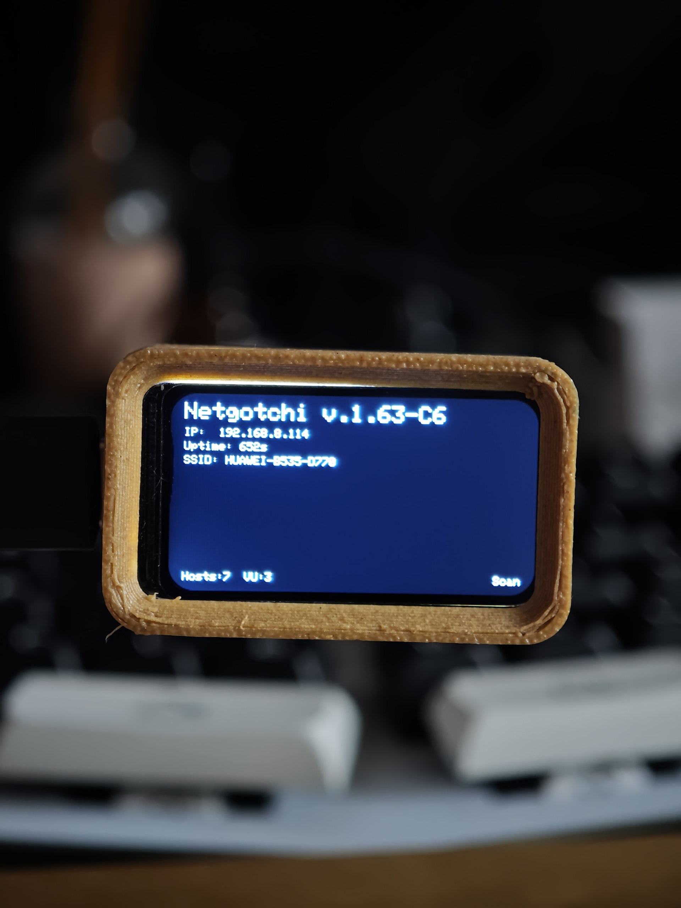
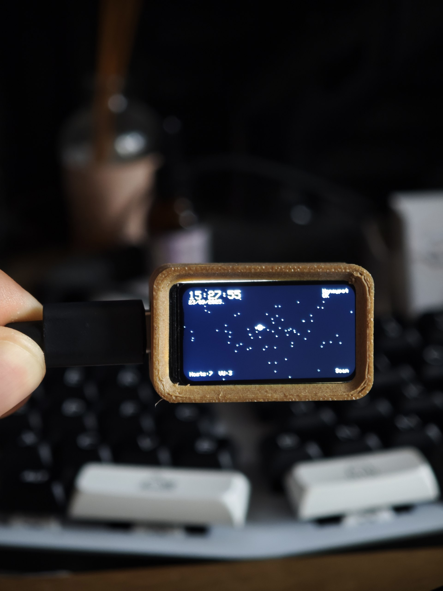
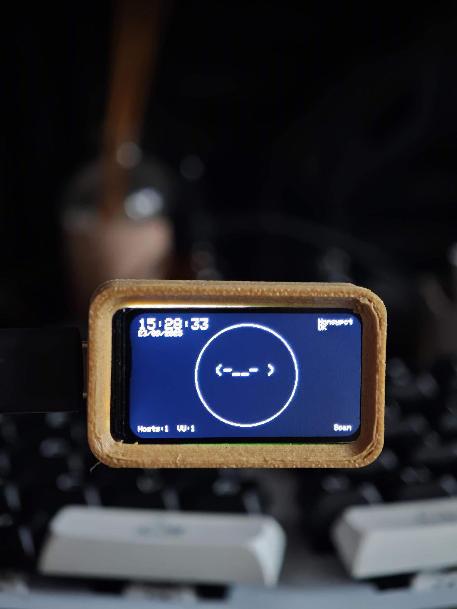
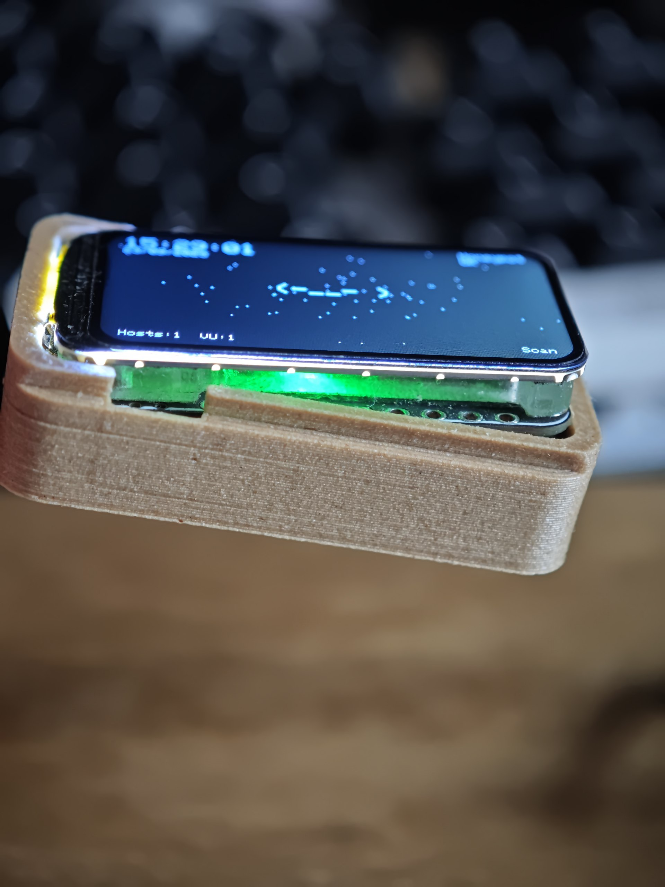

# 🛡️ Netgotchi - ESP32-C6 + ST7789 1.47" LCD Fork

> Netgotchi: Your network's loyal guardian! 🐾

This is a **community fork** of the original Netgotchi project, specifically adapted for **Waveshare ESP32-C6-LCD-1.47"** with **ST7789 display (172×320)** using Arduino IDE.

A small arduino .ino script with some great functions to detect intruders or breaches in the network, it pings periodically the network and reports if any new device. It also has a rudimental "Honeypot" functionality with a rudimental exposed service, once someone reaches the honeypot it will trigger an alarm. Please contribute to the repository via pull requests!

Tested with Nmap, service scan / intense scan will trigger the alert.

## 🔥 This Fork Features
- ✅ **ESP32-C6** compatibility with Arduino IDE
- ✅ **ST7789 1.47" TFT LCD** (172×320) support replacing OLED
- ✅ **ESP-NOW** API updated for ESP32 v3.x (IDF 5.x)
- ✅ **FTP disabled** with stub implementation (no SD_MMC dependency)
- ✅ **Deauther module excluded** (ESP8266 only) with safe stubs
- ✅ Various fixes: pin definitions, display initialization, WebUI compatibility

## ⚠️ AI Development Disclaimer
**All code modifications and adaptations in this fork were developed with assistance from ChatGPT-5 Extended Thinking**. While the code has been tested and works, there may be more optimal approaches or improvements possible. We encourage the community to:
- **Open issues** if you find bugs or have suggestions
- **Submit pull requests** with optimizations or improvements
- **Share better implementation approaches** for any of the adaptations made

Your expertise and contributions are welcome to make this fork even better!

## 🌟 Features

- 🔍 Periodic network scanning
- 🍯 Built-in "Honeypot" functionality
- 🚨 Intrusion detection and alerting
- 🖥️ Support for multiple OLED display types
- 🔄 Original supports ESP8266 and ESP32 (this fork specialized for ESP32-C6)

## 📸 ESP32-C6 Fork in Action

### Main Interface with Network Status

*Shows the main interface with IP address, uptime, network hosts count, and honeypot status - all displayed on the beautiful ST7789 color display*

### Network Monitoring Dashboard

*Network scanning visualization showing detected devices and connectivity status in real-time*

### Netgotchi Face Animation

*The iconic Netgotchi face with scan mode indicator - now in full color on the 1.47" TFT display*

### RGB LED Strip Integration

*Showcasing the RGB LED strip integration with the 3D printed case - adding visual network status indicators*

### Original Project Screenshots (for comparison)
 
*Original project with OLED display - compare with the colorful ST7789 version above!*

## 🛒 Support Original Development ❤

**This is a community fork. Please support the original creator [MXZZ](https://github.com/MXZZ)**:

- [Original Netgotchi on Tindie](https://www.tindie.com/products/ollestore/negotchi-network-security-scanner/)
- [Original Netgotchi on Etsy](https://olleadventures.etsy.com/listing/1752764124)

### Original Netgotchi PRO
The original project offers a PRO version with keypad interface, multiple modes (TEXTgotchi, CTRLgotchi), and audio alerts. **This fork focuses only on ESP32-C6 + ST7789 compatibility** and doesn't include the PRO features.
  

## 🛠️ Requirements (ESP32-C6 Fork)

### Hardware
- **Waveshare ESP32-C6-LCD-1.47"** board
- **ST7789 1.47" TFT LCD** (172×320 resolution)
- USB-C cable for programming
- Optional: **3D Printed Case** - [ESP32-C6 Display Case on MakerWorld](https://makerworld.com/it/models/1628925-esp32-c6-display-case)

### Software
- **Arduino IDE** with ESP32 Core v3.x
- **Board**: ESP32C6 Dev Module

### Libraries (Install via Library Manager)
- **Adafruit GFX Library**
- **Adafruit ST7735 and ST7789 Library**
- **WiFiManager** (by tzapu)
- **Button2** (by Lennart Hennigs)
- **NTPClient**
- **ESP32Ping** (optional, for min/avg/max ping stats)

### Original Requirements (for reference)
- ESP8266 or ESP32 (standard versions)
- OLED display (SSD1306, SH1106, or SSD1305)
- Optional: 3D printed case ([Community case for Wemos D1](https://www.printables.com/model/510481-terminal-for-ssd1306-096-oled-and-wemos-d1-mini))

## 📊 Wiring Diagram

### ESP32-C6 + ST7789 Pin Configuration (This Fork)

| Signal | GPIO | Function |
|:-------|:----:|:---------|
| MOSI   | 6    | SPI Data |
| SCLK   | 7    | SPI Clock |
| CS     | 14   | Chip Select |
| DC     | 15   | Data/Command |
| RST    | 21   | Reset |
| BL     | 22   | Backlight |

> **Note**: No MISO pin needed for ST7789 display.

### Original Wiring Diagrams (for reference)

**ESP8266**

**ESP32**

## 📚 Libraries

### ESP32-C6 Fork Libraries
- **ESP32 Core v3.x** (required for ESP32-C6 support)
- **Adafruit GFX Library**
- **Adafruit ST7735 and ST7789 Library** (replaces OLED libraries)
- **WiFiManager** (tzapu)
- **Button2** (Lennart Hennigs)
- **NTPClient**
- **ESP32Ping** (optional, for enhanced ping statistics)

> **Note**: FTP functionality is disabled in this fork with stub implementation (no SD_MMC dependency required)

### Original Libraries (for reference)
- ESP8266/ESP32 core libraries
- Modified FTP Server library (ESP8266FtpServer or ESP32FtpServer)
- Adafruit_SSD1306, Adafruit_SH110X, or Adafruit_SSD1305 (OLED displays)
- ESPping

## 🚀 How to Use (ESP32-C6 Fork)

### Setup Instructions

1. **Install ESP32 Board Package**: Make sure you have ESP32 Arduino Core v3.x installed
2. **Install Required Libraries**: Use Arduino Library Manager to install all libraries listed above
3. **Download Fork Files**: Clone or download this fork repository
4. **Open in Arduino IDE**: Open `netgotchi.ino` and ensure all accompanying files are loaded
5. **Select Board**: Choose "ESP32C6 Dev Module" from the board menu
6. **Verify Pins**: The fork automatically configures ST7789 pins (no manual configuration needed)
7. **Upload**: Compile and upload to your ESP32-C6 board

### Added Files (specific to this fork)
- `globals.h` - Unified include for all .ino files
- `pins_local.h` - Pin definitions (BTN_A/B/LEFT/RIGHT, BUZZER_PIN, etc.)
- `espnow.h` - ESP-NOW compatibility wrapper for ESP32 v3.x
- `ESPping.h` - Ping library mapping
- `compat/CompatST7789.h` - ST7789 compatibility layer

### First Boot
1. On first boot, Netgotchi creates a WiFi hotspot named "AutoConnectAP"
2. Connect to the hotspot and configure your WiFi credentials
3. Once connected, Netgotchi will start guarding your network on the ST7789 display!

### Key Differences from Original
- **Display**: Uses ST7789 TFT instead of OLED (colors supported!)
- **FTP**: Disabled (stub implementation, no SD card needed)
- **Deauther**: Disabled on ESP32-C6 (ESP8266 feature only)
- **ESP-NOW**: Updated for ESP32 v3.x compatibility

## 🖥️ Headless Mode (for Cyberdecks)

1. Open `utils/cyberdeck/pyserial_cyberdeck.py`
2. Change the COM port on line 5 (e.g., `/dev/ttyUSB0` for Linux, `COMx` for Windows)
3. Run the script

## 🔎 Vulnerability Scanning

Netgotchi scans for potentially vulnerable services including:
- Telnet (23)
- FTP (21)
- SSH (22)
- VNC (5900)
- RDP (3389)
- SMB (445)
- HTTP (80)
- HTTPS (443)

Vulnerable hosts are marked with "WRNG!". This feature can be toggled with the `securityScanActive` flag.

## 🖥️ Web Interface ( v.1.4 update)
Visit your netgotchi ip address at the port :80 ( the IP will be visible on the screen once connected )

## How to flash ( webmode - easy mode ) 
- Connect your ESP8266 or ESP32 or Netgotchi via USB cable ( Data cable)
- Use Chrome to go https://espressif.github.io/esptool-js/ 
- Press "Connect" 
- Press "Add File" , select Netgotchi.ino.bin ( Find it in "Release")
- Press "Flash" 
- Restart your Netgotchi , Enjoy!
- example on esp8266: 

## Status and animations explained 

- 1st Page  
top left corner : date and time  
top right corner : honeypot status ("ok" or if there is an attack it will appear as "breached")  
botton left corner : how many devices are active in the wifi network  
bottom center : number of VU ( vulnerabilities ) found  
bottom right corner : status - idle /scan  
center : netgotchi face and animations, the netgotchi will start crying ( T_T ) if there was an attack and it will display the attacker ip address. Netgotchi will display an "evil twin face" if someone cloned your wifi for an evil attack "( e_t )".  

- 2nd Page : 
active devices - UP for recently active, DOWN recently disconnected , WNR warning if they have a vulnerability

- 3rd Page : 
Network speed and network integrity ( ping, average speed, connection status )

- 4th Page :
Netgotchi IP and uptime 

- Extra:
Pro only : move page and setting menu on left button / right button  
V2 and Pro only : audio alarm on attack  
 
## 🔧 Troubleshooting (ESP32-C6 Fork)

### Common Issues
- **ESP-NOW compilation errors**: Ensure all `.ino` files include `globals.h` at the top
- **Missing `minTime()/maxTime()` functions**: Install ESP32Ping library or use only `averageTime()`
- **Display shows nothing**: Check wiring connections and ensure ST7789 library is installed
- **SD_MMC errors**: FTP is disabled in this fork, these errors shouldn't occur
- **WebUI matrix appears empty**: This is normal on ST7789 (no framebuffer for 128×64 matrix view)

### Legal Notice
**Deauther functions are disabled on ESP32-C6** and may be illegal in many countries. This fork focuses on network monitoring only.

## 😊 Join Community

**Original Project Discord**: [Join Now](https://discord.gg/hM4w8eTKrt)!
**Original Reddit Community**: [r/Netgotchi](https://www.reddit.com/r/Netgotchi/)

> This fork is community-maintained. For original project support, use the official channels above.

## 🤝 Contributing to This Fork

We welcome contributions to improve the ESP32-C6 + ST7789 compatibility! Please:
- **Open issues** for bugs or enhancement requests
- **Submit pull requests** with improvements
- **Share optimization ideas** - remember, this was developed with AI assistance
- **Test on different ESP32-C6 boards** and report compatibility

For the original project, please contribute to [MXZZ/Netgotchi](https://github.com/MXZZ/Netgotchi).

## 🔄 Fork Information

This is a community fork of the original Netgotchi project, specifically adapted for ESP32-C6 + ST7789 1.47" display compatibility.

**Original Project**: [Netgotchi by MXZZ](https://github.com/MXZZ/Netgotchi)
**Fork Author**: [Federicokalik](https://github.com/Federicokalik)
**Fork Focus**: ESP32-C6 + ST7789 display support with Arduino IDE compatibility
**Development**: Fork with ChatGPT-5 Extended Thinking assistance

## 📜 License

GNU General Public License v3.0

**Original Project** created with ❤️ by MG [MXZZ](https://github.com/MXZZ) | ESP32 Port by [itsOwen](https://github.com/itsOwen)
**ESP32-C6 + ST7789 Fork** by [Federicokalik](https://github.com/Federicokalik) with ChatGPT-5 Extended Thinking assistance
